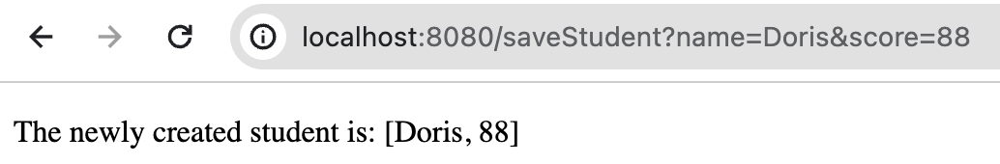

# spring-boot-thymeleaf-app

This is a `Spring Boot` application using `Thymeleaf` HTML template.

`Thymeleaf` is a server-side Java-based template engine for both web and standalone environments, capable of processing HTML, XML, JavaScript, CSS and even plain text. It is more powerful than JPS and responsible for dynamic content rendering on UI. The engine allows a parallel work of the backend and frontend developers on the same view. It can directly access the java object and spring beans and bind them with UI. And it is mostly used with spring MVC when creating any web application.

## Features Implemented
- Pass data to template
- Pass objects to template
- Pass multiple objects to template
- Pre-render and Process form data

## Project Structure

## Demo
- Display form with default input:

- Handle form submit:

